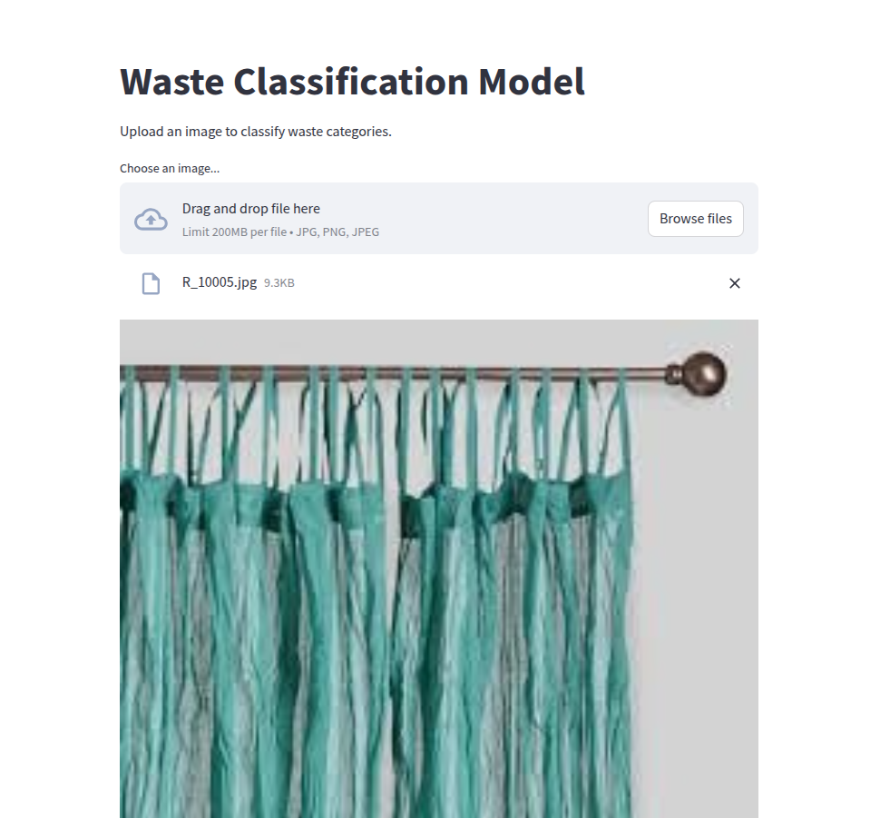
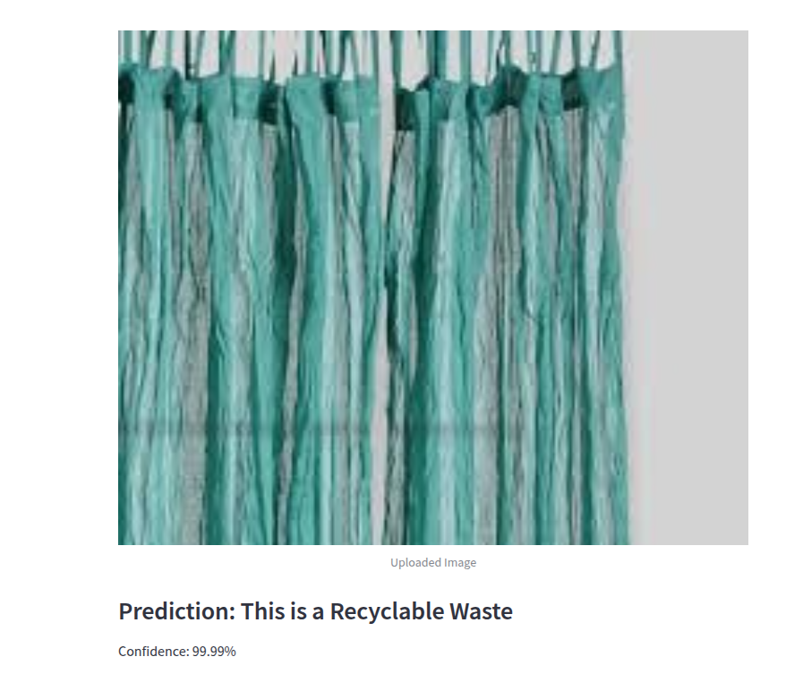

# 🗑 Waste Classification Streamlit App  

This is a **Streamlit web application** that allows users to **upload an image**, resizes it similar to `ImageDataGenerator`, and predicts the **waste category** using a pre-trained deep learning model.

---

## 🚀 **Installation Instructions**  

Follow these steps to set up and run the **Waste Classification App** on your local system.

### **Step 1: Clone the Repository**  
Open a terminal and run:  
```sh
git clone https://github.com/your-repository-name.git
cd your-repository-name
```

### **Step 2: Create a Virtual Environment (Optional but Recommended)**
For Python 3, run:
```

python -m venv env
source env/bin/activate  # On Windows: env\Scripts\activate
```

### **Step 3: Install Required Dependencies**
Install all necessary packages by running:
```

pip install -r requirements.txt
```

### **Step 4: Train the Model**
Run the following command in your terminal:
```
python train.py
```

### **Step 5: Run the Streamlit App**
To launch the Streamlit app, run:
```
streamlit run app.py
```

## 🎯 **How It Works**
1. **Upload an Image**
    * The user uploads an image (PNG, JPG, or JPEG).
    * The uploaded image is displayed on the screen.

2. **Preprocessing (Like ImageDataGenerator)**
    * The image is resized to **224x224** (or the model’s input size).
    * Pixel values are normalized **between 0 and 1**.

3. **Model Prediction**
    * The trained model makes a prediction.
    * The predicted waste category and confidence score are displayed.
## 🖼️ **Example Screenshots**  

### **1️⃣ Uploading an Image**  
{width=100%}  

### **2️⃣ Model Making a Prediction**  
{width=100%}    

## 📂 **Project Directory Structure**
    waste_classification_app/
    │── app.py                     # Streamlit Application
    │── waste_classification_model.h5  # Trained Model File
    │── requirements.txt            # Dependencies
    │── README.md                   # Documentation
    │── assets/                     # Folder for screenshots
    │   ├── upload_example.png
    │   ├── prediction_example.png

## 👨‍💻 **Author**
* **Kapil Yadav**
* 📧 **Contact**: **ykapil897@gmail.com**
* 🔗 **GitHub**: **https://github.com/ykapil897**


